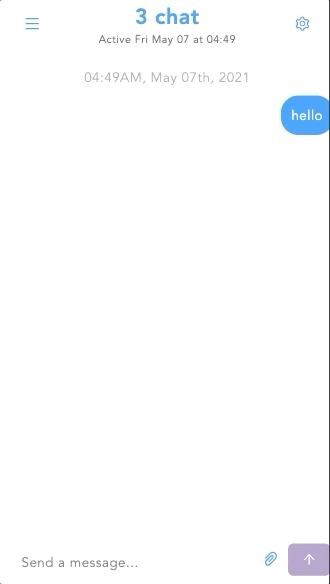

# React CHAT
# live link ( make sure to choose an Avenger so you can log in and test the app)
[react-chat](https://8c0a3204.react-chat-app.pages.dev).

# Description 
chat with friends as an Avenger

## Avengers Assemble

Log in using any of the 4 username below with the password "digitalcraft" in order to test the application.

1.CaptainAmerica

2.Thor

3.Spiderman

4.BlackWidow

# Technologies 
- chatengine.io
- npm install --legacy-peer-deps react-chat-engine
- React
- npm install @ant-design/icons

## How to develop it

- Clone on your local machine by using `https://github.com/Ernie0921/React-Chat-app.git`
- Navigate into the main directory
- Run `npm install` to install node modules
- Run `npm start` to run it locally then will open automatclly on your browser on `localhost:3000` port
- Run `npm run build` to create a production build

# view mobile

